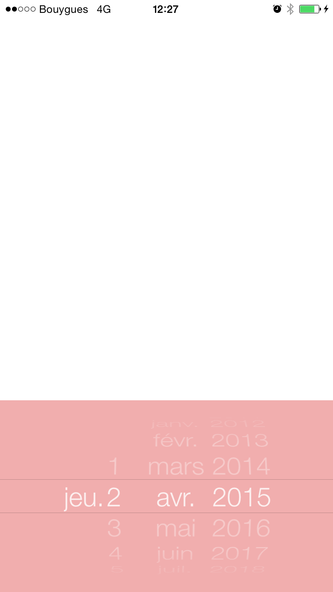
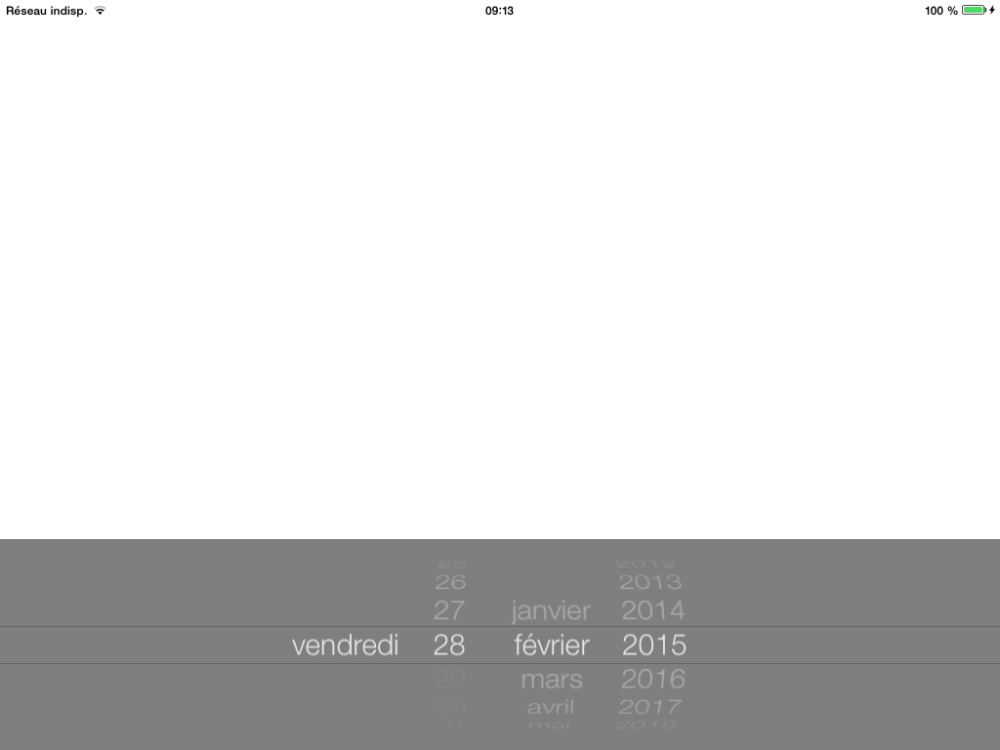

# MUDatePicker


<p align="center">
	
</p>

<p align="center">
	
</p>

A real customizable DatePicker for iOS that shows the Day name without the timestamp.

#### Podfile

...Soon

## Genesis
My company's customers needed a simple way to choose a date in some form in my company's app. The classic UIDateTimePicker can show a date selection, but doesn't show the DAY NAME of the chosen date. There is an option, in this UIDateTimePicker to show the day name, but it will also show a TIME picker, which is not useful for my customers.
Furthermore, the classic iOS DateTimePicker doesn't allow user to easily customize (color, font) the classic picker.  

## Information
For the time beeing, it is NON-ARC. I know, we are in 2015, and it should definitely be ARC compliant. But the project for which I created this Picker is an old non-arc project. That's why ! I'll update it :-) 

## Basic Usage

Import the class header.

``` objective-c
#import "MUDatePicker.h"
```

Just create your date picker in a frame.

``` objective-c
- (void)viewDidLoad
{
	[super viewDidLoad];
	
	MUDatePicker *datePicker = [[MUDatePicker alloc]initWithFrame:CGRectMake(0, self.view.frame.size.height - 216, self.view.frame.size.width , 216)];

```

Then you can customize it : 

``` objective-c

	datePicker.backgroundColor = [UIColor colorWithRed:227/255.f green:93/255.f blue:93/255.f alpha:0.5];
    
    
    datePicker.columnDayNameWidth = 100;
    datePicker.columnDayWidth = 100;
    datePicker.columnMonthWidth = 100;
    datePicker.columnYearWidth = 100;
    
    datePicker.fontColor = [UIColor whiteColor];
    datePicker.dateFont = [UIFont fontWithName:@"HelveticaNeue-Light" size:30];

```

and add it to your view 

``` objective-c

 //Select the today date on the picker
    [datePicker showDateOnPicker:[NSDate new]];
    [self.view addSubview:datePicker];
}

```

and ... that's it !

## Coming Soon

Use of the delegate

## Demo

Build and run the `MUDatePickerExample` project in Xcode to see the `MUDatePicker` in action.
Have fun. Make it faster. Fork and send pull requests. Figure out hooks for customization.

## Contact

Maxime Urban

- https://github.com/MoKeS-
- https://twitter.com/MoKeS_
- maxime.urban@gmail.com


It is my first repo on Github, had some trouble to get things properly online. Sorry for all the wrong commits.

